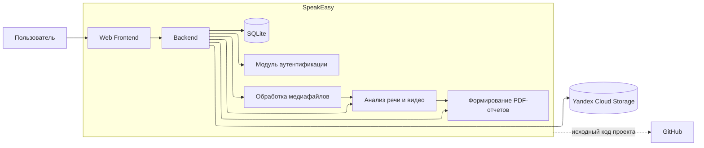

# Паспорт индивидуального проекта

## 1\. Идентификация

**Название проекта:**  
SpeakEasy \- сервис для тренировки публичных онлайн выступлений.

**Программный продукт:**  
Веб-приложение, в котором пользователь регистрируется, записывает или загружает аудио/видео своего выступления, получает автоматическую аналитику по речи и видео.

**Рассматриваемая версия / сборка / состояние:**  
Версия `0.1.0`. Рассматривается учебный MVP, запускаемый локально на `127.0.0.1:8000` и `127.0.0.1:5500`.

---

## 2\. Организационный контекст

**Описание:**  
SpeakEasy рассматривается как индивидуальный учебный проект, разрабатываемый и сопровождаемый автором проекта. Продукт предназначен для пользователей, которым нужно тренировать публичные онлайн выступления: студентов, начинающих спикеров, сотрудников, готовящих презентации, питчи, подкасты или свободные выступления.

В текущем виде продукт используется в локальной среде разработки. Решения об изменениях и выпуске MVP принимает автор проекта. Отдельной команды сопровождения, DevOps или AppSec в рамках учебного проекта нет.

---

## 3\. Назначение продукта

**Описание:**  
SpeakEasy помогает пользователю получить обратную связь по тренировочному выступлению. Пользователь выбирает сценарий, записывает или загружает аудио/видео длительностью от 3 до 15 минут, после чего сервис анализирует запись и показывает оценку, рекомендации, метрики и прогресс.

Основные функции продукта:

- регистрация, вход и выход;  
- запись или загрузка аудио/видео выступления;  
- проверка формата и длительности файла;  
- сохранение практик в личном кабинете пользователя;  
- автоматическая транскрибация речи;  
- анализ темпа речи, пауз, слов-паразитов и громкости;  
- анализ видео по визуальным параметрам, если загружена видеозапись;  
- отображение аналитики и динамики результатов;  
- удаление, восстановление и хранение практик в корзине;  
- экспорт отчета по практике в PDF.

Результат для пользователя \- понятная оценка выступления, рекомендации по улучшению и история тренировок.

---

## 4\. Пользователи и заинтересованные стороны

### Пользователи

- **Незарегистрированный пользователь** \- создает аккаунт.  
- **Зарегистрированный пользователь** \- входит в систему, записывает или загружает практики, просматривает аналитику.

### Заинтересованные стороны

- автор проекта;  
- пользователи, тренирующие публичные выступления;  
- научный руководитель;  
- внешние поставщики сервисов.

---

## 5\. Границы проекта

### В рассматриваемый объект входит

- frontend-приложение;  
- backend API на FastAPI;  
- локальная SQLite-база;  
- механизмы регистрации, входа, выхода и продления сессии;  
- загрузка и обработка аудио/видеофайлов;  
- интеграция с S3-совместимым объектным хранилищем Yandex Cloud Storage;  
- анализ речи с использованием GigaAM, Whisper и Silero VAD;  
- анализ видео через MediaPipe и связанные библиотеки;  
- генерация PDF-отчетов;  
- конфигурационные файлы и инструкции локального запуска.

### За пределами проекта остается

- production-инфраструктура и ее администрирование;  
- реальные пользовательские данные, не относящиеся к учебному тестированию;  
- внутреннее устройство сторонних ML-моделей и библиотек;  
- инфраструктура Yandex Cloud Storage ниже уровня используемого S3 API;  
- браузер пользователя, операционная система и разрешения на камеру/микрофон;  
- юридические вопросы обработки биометрических, голосовых и персональных данных в production среде.

### Обоснование границ

Границы выбраны так, чтобы охватить код и данные, которыми управляет автор проекта. Внешние сервисы рассматриваются как зависимости и границы доверия, но их внутренняя реализация не входит в объект учебного анализа.

---

## 6\. Компоненты и внешние взаимодействия

### Основные компоненты

- **Web Frontend** \- веб\-интерфейс системы, через который пользователь регистрируется и авторизуется, загружает аудио и видеофайлы, запускает практику, просматривает результаты анализа и сформированные отчеты.  
- **Backend** \- основной серверный компонент системы. Реализует бизнес-логику веб\-приложения, работу с пользователями и сессиями, обработку загружаемых файлов, взаимодействие с базой данных, ML-модулями и объектным хранилищем.  
- **SQLite** \- локальная БД. Хранит информацию о пользователях, пользовательских сессиях, практиках и сформированных аналитических отчетах.  
- **Модуль обработки медиафайлов** \- выполняет подготовку загруженных аудио и видеофайлов к дальнейшему анализу.  
- **Модуль анализа речи** \- выполняет обработку аудиодорожки выступления.  
- **Модуль анализа видео** \- обрабатывает видеозапись выступления.  
- **Модуль аналитики** \- объединяет результаты анализа речи и видео, рассчитывает показатели выступления и формирует данные, используемые для обратной связи пользователю.  
- **Модуль формирования отчетов** \- формирует итоговые PDF-отчеты по результатам практики.  
- **Модуль работы с объектным хранилищем** \- обеспечивает загрузку, получение и хранение медиафайлов.  
- **Модуль аутентификации** **и управления сессиями** \- обеспечивает регистрацию и вход пользователей, завершение и продление пользовательских сессий и проверку прав доступа к функциям системы.

### Внешние системы и сервисы

- браузер пользователя с доступом к микрофону и камере;  
- Yandex Cloud Storage;  
- GitHub \- репозиторий.

### Схема

Существенные границы доверия проходят между браузером пользователя и Backend SpeakEasy, между Backend и внешним хранилищем Yandex Cloud Storage, а также между локальной средой разработки и внешним Git-репозиторием.

---

## 7\. Защищаемые активы

### Основные активы

- учетные записи пользователей: email, имя, хэши паролей;  
- сессионные токены;  
- аудио и видеозаписи выступлений;  
- результаты транскрибации, аналитики и сформированные отчеты;  
- локальная SQLite-база;  
- объекты в S3-совместимом хранилище;  
- исходный код приложения;  
- конфигурационные данные и секреты приложения (ключи доступа и т.д.).

Особенно критичны:

1. учетные данные пользователей, сессионные токены;  
2. аудио и видеозаписи выступлений пользователей;  
3. секреты и ключи доступа к внешним сервисам и хранилищам;  
4. целостность алгоритмов расчета метрик, аналитических результатов и формируемых отчетов.

---

## 8\. Границы доверия

### Граница доверия 1

**Между:** браузером пользователя и Backend SpeakEasy.  
**Что пересекает границу:** регистрационные и аутентификационные данные, сессионные токены, запросы к API, загружаемые аудио и видеофайлы, результаты анализа и отчеты.  
**Почему граница существенна:** браузер пользователя находится во внешней, недоверенной среде, а Backend \- в контролируемой серверной среде SpeakEasy. Пользователь может изменять отправляемые запросы, параметры и файлы, поэтому Backend должен выполнять аутентификацию, авторизацию и проверку входных данных.

### Граница доверия 2

**Между:** Backend SpeakEasy и Yandex Cloud Storage.  
**Что пересекает границу:** аудио и видеофайлы пользователей, идентификаторы и метаданные объектов, запросы на загрузку и получение файлов, данные для доступа к хранилищу.  
**Почему граница существенна:** Backend находится внутри среды SpeakEasy, а Yandex Cloud Storage является внешним облачным сервисом. При взаимодействии с ним пользовательские данные покидают локальную среду приложения, поэтому необходимо контролировать доступ к файлам и защищать учетные данные для доступа к хранилищу.

### Граница доверия 3

**Между:** локальной средой разработки SpeakEasy и внешним репозиторием проекта.  
**Что пересекает границу:** исходный код, конфигурационные файлы и другие материалы проекта. Локальная база данных, логи, загруженные пользовательские записи и secrets.env не должны передаваться во внешний репозиторий.  
**Почему граница существенна:** локальная среда содержит секреты доступа и пользовательские данные, которые не предназначены для публикации. Случайное добавление таких данных в репозиторий может привести к их раскрытию.

---

## 9\. Доступные материалы

- [x] исходный код;  
- [x] история Git / система контроля версий;  
- [x] перечень сторонних зависимостей;  
- [ ] файлы сборки;  
- [x] конфигурационные файлы (без секретных значений);  
- [x] архитектурная или техническая документация;  
- [ ] автоматизированные тесты;  
- [ ] CI/CD;  
- [x] возможность собрать продукт;  
- [x] возможность запустить продукт;  
- [x] доступ к тестовой среде;  
- [ ] журналы / результаты предыдущих проверок;  
- [ ] иное:

### Пояснения

Исходный код проекта доступен в GitHub. Проект может быть развернут и запущен локально в соответствии с инструкцией в README. Автоматизированные тесты и CI/CD в проекте не используются.

---

## 10\. Текущее состояние разработки

**Описание:**  
Исходный код хранится в GitHub \- репозитории проекта SpeakEasy. Проект состоит из backend на Python/FastAPI и frontend в виде статических HTML/CSS/JS-файлов.

Основная разработка ведется автором проекта локально. Изменения вносятся напрямую в рабочую копию и фиксируются в Git-коммитах. Использование feature branches, merge requests и отдельного issue tracker в текущем состоянии проекта не зафиксировано. Формальный code review не применяется, так как проект является индивидуальным учебным MVP и сопровождается одним разработчиком.

Автоматизированные тесты в структуре проекта явно не представлены. Проверка работоспособности выполняется вручную через локальный запуск backend и frontend, обращение к API и тестирование основных пользовательских сценариев: регистрация, вход, загрузка или запись выступления, просмотр аналитики и отчетов.

Отдельный этап сборки отсутствует. Backend запускается через `uvicorn` на `127.0.0.1:8000`, frontend запускается через простой HTTP-сервер на `127.0.0.1:5500`. Зависимости backend перечислены в `backend requirements.txt`, инструкция по запуску описана в `README.md`.

Постоянный CI/CD pipeline и автоматизированные security-проверки не настроены. Контроль зависимостей, секретов и локальных данных выполняется вручную по мере необходимости.

Решение о выпуске текущей версии MVP принимает автор проекта. Выпуск фактически означает подготовку локально запускаемого состояния проекта, при котором основные функции работают в среде разработки.

Найденные проблемы обрабатываются вручную: автор воспроизводит ошибку локально, анализирует поведение приложения и логи, после чего вносит исправления в backend или frontend.

---

## 11\. Ограничения и допущения

### Ограничения

- проект находится в состоянии локального MVP, а не production-сервиса;  
- часть сервисов зависит от секретов в secrets.env, которые нельзя раскрывать;  
- корректная работа анализа зависит от тяжелых ML-зависимостей и доступности моделей;  
- автоматизированные тесты и CI/CD не представлены;  
- анализ ограничивается текущим состоянием репозитория и локальной средой;  
- юридические аспекты хранения аудио/видео и голоса пользователей отдельно не проработаны.

### Допущения

- организационный контекст является учебным и условным;  
- для дальнейшей работы используются собственные тестовые записи, а не персональные данные третьих лиц;  
- локальная среда разработки и устройство разработчика считаются доверенными.

---

## 12\. Конфиденциальность

**Описание:**  
Проект SpeakEasy может содержать персональные данные пользователей, включая имя, email, аудио и видеозаписи, результаты транскрибации и аналитики. В учебной версии используются собственные тестовые записи и тестовые учетные данные.

Коммерческая тайна и клиентские данные в проекте не используются.

Исходный код проекта может использоваться в учебных материалах. При этом локальные конфигурационные файлы, содержащие секреты, а также базы данных, логи и пользовательские файлы не должны включаться в публикуемые материалы.

Для работы проекта могут использоваться ключи, токены и другие секреты, хранящиеся в secrets.env. Файл с реальными значениями не публикуется.

Во внешние сервисы и генеративные модели не должны передаваться секреты, содержимое локальной базы данных и аудио или видеозаписи, содержащие персональные данные.

Для учебных материалов и внешней проверки используется отдельная копия проекта, не связанная с рабочим репозиторием и не содержащая секретов, чувствительных данных и иных материалов, которые не должны изменяться или распространяться.

---

## 13\. Возможность дальнейшей практической работы

### Воспроизводимость исследования

**Можно ли воспроизводимо исследовать выбранную версию / состояние объекта?**  
Частично. Исходный код проекта можно развернуть и запустить локально по инструкции из README.md, при этом будет создана новая пустая локальная база данных.  
Текущая БД не публикуется: файлы \*.db исключены через .gitignore, так как могут содержать пользовательские данные и результаты аналитики. Также без secrets.env будет недоступна обработка и хранение медиафайлов, поскольку секреты для внешнего хранилища не публикуются..

### Сторонние зависимости

**Можно ли получить информацию о сторонних зависимостях продукта?**  
Да. Основные зависимости backend перечислены в `backend/requirements.txt`. Также известны используемые ML-модели, библиотеки обработки аудио и видео и внешние сервисы.

### Возможность изменения

**Можно ли выполнить хотя бы одно техническое или процессно-техническое улучшение?**  
Да. В учебной копии проекта можно изменять backend и frontend, конфигурацию и отдельные механизмы безопасности, не затрагивая основной репозиторий проекта.

### Возможность повторной проверки

**Можно ли проверить результат выполненного улучшения?**  
Да. После изменения можно повторно запустить проект в локальной среде и вручную повторить соответствующие пользовательские сценарии и методы анализа.

### Итоговая оценка пригодности

- [x] объект пригоден для дальнейшей работы;  
- [ ] объект пригоден с ограничениями;  
- [ ] есть существенные сомнения, требуется консультация с преподавателем.

**Пояснение:**  
Объект пригоден для дальнейшей работы: исходный код доступен, основные компоненты проекта разворачиваются локально, что позволяет проводить проверки, вносить изменения и повторно оценивать результат без production-инфраструктуры.

---

## 14\. Вопросы и неопределенности

На текущем этапе существенных вопросов и неопределенностей, требующих отдельного согласования с преподавателем, нет.

---

## 15\. Самопроверка перед отправкой

- [x] указан конкретный программный продукт;  
- [x] зафиксирована конкретная версия / сборка / состояние;  
- [x] понятен организационный контекст;  
- [x] определены границы проекта;  
- [x] указано, что входит и что не входит в рассматриваемый объект;  
- [x] есть простая схема продукта;  
- [x] определены основные компоненты и внешние взаимодействия;  
- [x] перечислены основные защищаемые активы;  
- [x] обозначены существенные границы доверия;  
- [x] понятно, какие материалы доступны;  
- [x] указаны существенные ограничения и допущения;  
- [x] учтены ограничения конфиденциальности;  
- [x] объект можно воспроизводимо исследовать;  
- [x] на объекте потенциально можно выполнить хотя бы одно улучшение;  
- [x] результат улучшения потенциально можно проверить повторно.

---

## Нулевое согласование

> Этот раздел заполняет преподаватель.

### Решение

- [ ] согласовано;  
- [ ] согласовано с обязательными условиями;  
- [ ] требуется корректировка;  
- [ ] организационный контекст необходимо отделить от технического объекта;  
- [ ] предоставляется резервный объект.

### Обязательные условия / замечания

- ...  
- ...

### Что необходимо скорректировать

- ...  
- ...

### Дополнительные комментарии

...  
